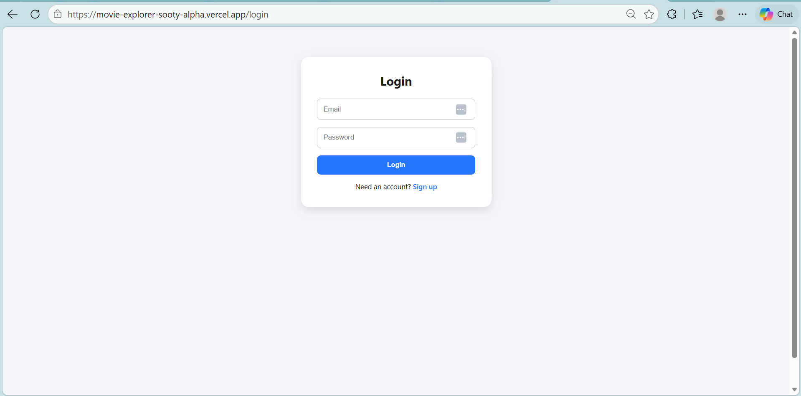
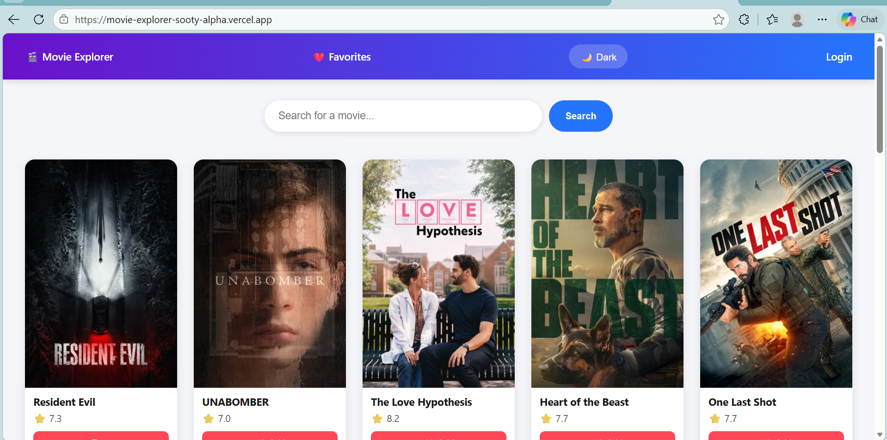
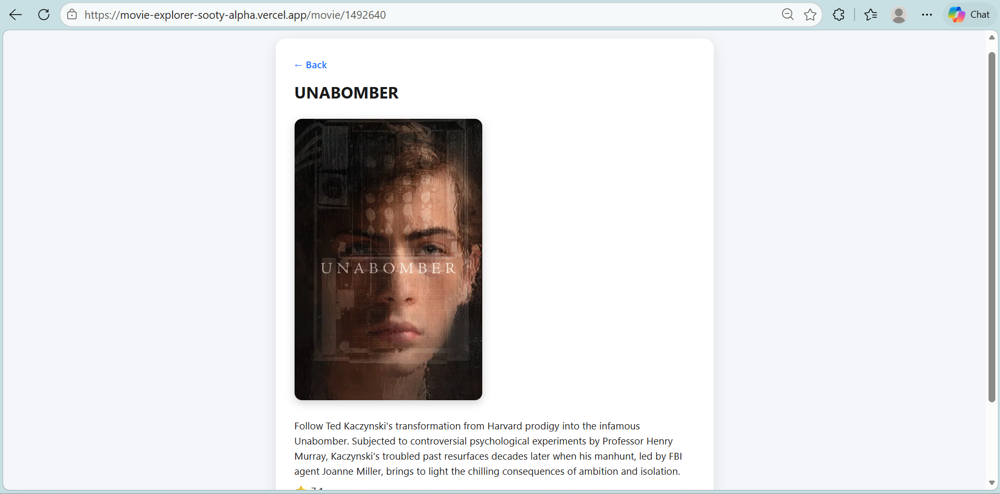
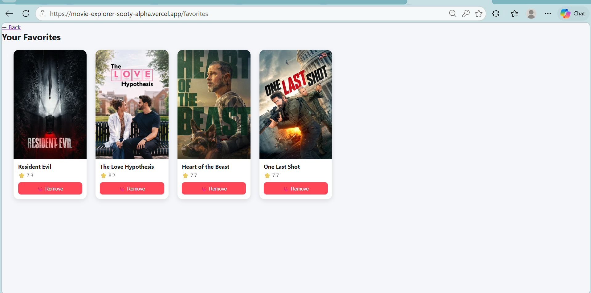

🎬 Movie Explorer

A full-stack movie discovery web app built with React — search for movies, view details, save favorites, switch between dark/light themes, and manage your account with secure authentication.

🔗 Live Demo: [Add your Vercel link here] 📂 Repository: [Add your GitHub link here]

📸 Screenshots

Add 2–3 screenshots here once your UI is ready — home page, movie details page, and favorites page work well.

✨ Features
🔍 Search movies in real-time using the TMDB API
📈 Trending movies shown by default on the homepage
🎥 Movie details page with poster, overview, rating, and release date
❤️ Favorites — add/remove movies, persisted with localStorage
🌗 Dark/Light theme toggle, saved across sessions
🔐 Authentication — sign up, log in, log out (Firebase Auth)
🔒 Protected routes — Favorites page accessible only to logged-in users
📱 Responsive design with smooth hover animations and transitions
⚡ Auto-deployed via Vercel (CI/CD on every GitHub push)

🛠️ Tech Stack
Category	Tech
Frontend	React (Hooks, Context API, React Router)
Styling	Custom CSS (Grid, Flexbox, animations)
Authentication	Firebase Authentication
Data Source	TMDB API
Build Tool	Vite
Deployment	Vercel
Version Control	Git & GitHub

🧠 Key React Concepts Used
Functional components & JSX
useState, useEffect, useContext, useParams
Custom hooks (useAuth, useFavorites, useTheme)
Context API for global state (Auth, Favorites, Theme)
Controlled components (forms)
Client-side routing with React Router (Routes, Route, Link, Navigate)
Protected routes based on authentication state
Async data fetching with async/await and proper loading/error states
Environment variables for secure API key handling

🚀 Getting Started (Run Locally)
Prerequisites
Node.js (v16 or higher)
A free TMDB API key
A free Firebase project with Email/Password authentication enabled
Installation
Clone the repository
bash
   git clone https://github.com/YOUR_USERNAME/movie-explorer.git
   cd movie-explorer
Install dependencies
bash
   npm install
Set up environment variables Create a .env file in the root directory:
   VITE_TMDB_API_KEY=your_tmdb_api_key
   VITE_FIREBASE_API_KEY=your_firebase_api_key
   VITE_FIREBASE_AUTH_DOMAIN=your_firebase_auth_domain
   VITE_FIREBASE_PROJECT_ID=your_firebase_project_id
   VITE_FIREBASE_APP_ID=your_firebase_app_id
Run the development server
bash
   npm run dev
Open http://localhost:5173 in your browser 🎉

📁 Project Structure
movie-explorer/
├── src/
│   ├── components/       # Reusable UI components
│   │   ├── Navbar.jsx
│   │   ├── SearchBar.jsx
│   │   ├── MovieCard.jsx
│   │   ├── MovieList.jsx
│   │   └── ProtectedRoute.jsx
│   ├── pages/            # Full page views tied to routes
│   │   ├── Home.jsx
│   │   ├── MovieDetails.jsx
│   │   ├── Favorites.jsx
│   │   ├── Login.jsx
│   │   └── Signup.jsx
│   ├── context/           # Global state via Context API
│   │   ├── AuthContext.jsx
│   │   ├── FavoritesContext.jsx
│   │   └── ThemeContext.jsx
│   ├── firebase.js        # Firebase configuration
│   ├── App.jsx
│   ├── main.jsx
│   └── index.css
├── .env                    # Environment variables (not committed)
├── .gitignore
└── package.json

🔮 Future Improvements
 Add pagination for search results
 Migrate to TypeScript
 Add unit tests (Jest / React Testing Library)
 Add movie recommendations based on favorites
 Add a Google/social login option via Firebase
